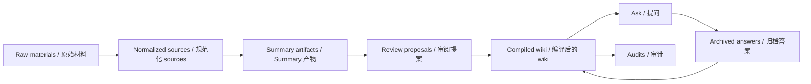

<h1 align="center">Research Wiki Compiler</h1>

<p align="center">
  <strong>把原始研究材料编译成可审阅、可追踪、可长期维护的本地 Markdown Wiki。</strong>
  <br />
  <strong>Compile raw research material into a local Markdown wiki that stays reviewable, traceable, and durable.</strong>
</p>

<p align="center">
  local-first / file-first / review-first / wiki-first retrieval
</p>

<p align="center">
  编译 → 审阅 → 提问 → 归档 → 审计
  <br />
  Compile → Review → Ask → Archive → Audit
</p>

<p align="center">
  <a href="#rendered-example--渲染示例">Rendered Example / 渲染示例</a>
  ·
  <a href="#quickstart--快速开始">Quickstart / 快速开始</a>
  ·
  <a href="#quick-demo--快速体验">Quick Demo / 快速体验</a>
  ·
  <a href="./docs/official-showcase.md">Official Showcase / 官方案例</a>
  ·
  <a href="./examples/openclaw-wiki/README.md">OpenClaw Example / OpenClaw 示例</a>
  ·
  <a href="./docs/merge-review-guide.md">Review Guide / 评审指引</a>
  ·
  <a href="./docs/topic-bootstrap.md">Topic Bootstrap / 主题启动</a>
  ·
  <a href="./docs/topic-maturity.md">Topic Maturity / 主题成熟度</a>
  ·
  <a href="./docs/architecture.md">Architecture / 架构</a>
  ·
  <a href="./docs/product-spec.md">Product Spec / 产品规格</a>
  ·
  <a href="./SUPPORT.md">Support / 支持</a>
  ·
  <a href="./SECURITY.md">Security / 安全</a>
  ·
  <a href="./CONTRIBUTING.md">Contributing / 贡献</a>
</p>

<p align="center">
  
  
  
  
</p>

<p align="center">
  <a href="./docs/official-showcase.md"></a>
  <a href="./examples/openclaw-wiki/README.md"></a>
  <a href="#quickstart--快速开始"></a>
  <a href="./docs/architecture.md"></a>
  <a href="./docs/product-spec.md"></a>
</p>

Research Wiki Compiler 不是“上传文件然后聊天”的壳。它把原始资料放进本地工作区，生成可见的 summary、review proposal、answer artifact 和 audit report，并把真正长期维护的知识沉淀为 Markdown wiki 页面。  
Research Wiki Compiler is not an upload-and-chat shell. It lands raw material in a local workspace, produces visible summaries, review proposals, answer artifacts, and audit reports, and stores the durable knowledge layer as Markdown wiki pages.

- 原始材料先变成可见 artifact，再变成可审阅的 wiki mutation。  
  Raw material becomes visible artifacts first, then reviewable wiki mutation.
- 最终结果是持续维护的 Markdown wiki，不是一次性的模型输出。  
  The end state is a maintained Markdown wiki, not a one-shot model output.
- 好答案会重新进入 wiki，审计会继续暴露结构缺口。  
  Good answers re-enter the wiki, and audits keep exposing structural gaps.

| Visible artifacts / 可见产物 | Review-first mutation / 审阅优先变更 | Wiki-first retrieval / Wiki 优先检索 |
| --- | --- | --- |
| prompt、summary、proposal、audit 都保留在文件系统里。<br />Prompts, summaries, proposals, and audits stay visible on disk. | 知识更新先变成 proposal，再决定是否进入 wiki。<br />Knowledge updates become proposals before they mutate the wiki. | 回答先查 compiled wiki，再回退到 summary 和 raw chunks。<br />Answers consult the compiled wiki first, then fall back to summaries and raw chunks. |

## Rendered Example / 渲染示例

如果你想最快理解这个项目，不要先从文件树开始。先跑 app，然后打开渲染后的 OpenClaw 示例路线。  
If you want the fastest path to understanding this project, do not start with the file tree. Run the app first, then open the rendered OpenClaw showcase route.

> Start here / 从这里开始  
> 1. `npm install && npm run dev`  
> 2. 打开 Next 启动时打印出来的本地地址，通常是 `http://localhost:3000/topics`  
> 3. 进入一个 topic home，例如 `/topics/openclaw`  
> 4. 再按默认路径看 `questions -> sessions -> syntheses`  
> 5. 最后再回来看 GitHub 里的 Markdown 源文件和中间 artifact

| What to open | Why it matters |
| --- | --- |
| Topic portfolio route: `/topics` | 这是新的多主题产品入口，也是默认前门。先从这里选 topic，再进入 topic home。<br />This is the multi-topic front door and the default place to start. Pick a topic here, then enter its topic home. |
| Topic home route: `/topics/openclaw` | 这是默认工作驾驶舱。它会先告诉你当前 topic 状态、最重要的问题、该继续的 session、最接近的 synthesis，以及哪些 signals 只是次级支持面。<br />This is the default working cockpit. It tells you the current topic state, the most important question, the session to continue, the closest synthesis, and which signals are only supporting surfaces. |
| Research question route: `/questions` | 这是 topic home 之后的主工作入口，用来决定接下来该研究哪个问题、该先加载哪个 context pack、哪些问题已经接近 synthesis。<br />This is the main working lane after topic home. Use it to decide which question to work next, which context pack to load first, and which questions are close to synthesis. |
| Session route: `/sessions` | 这是默认路径的下一站，把问题转成有边界的实际工作。<br />This is the next stop in the default path, where questions become bounded research work. |
| Synthesis route: `/syntheses` | 这是默认路径里把研究工作变成 durable judgment 的地方。<br />This is where the default path hardens research work into durable judgment. |
| Rendered example route: `/examples/openclaw` | 这是产品里的渲染视图，能直接看到 wiki 页面、链接关系和示例入口。<br />This is the rendered product view, where the wiki pages, links, and example framing are easiest to understand. |
| Source-of-truth wiki files: [`examples/openclaw-wiki/workspace/wiki/`](./examples/openclaw-wiki/workspace/wiki/) | 这些 Markdown 文件就是最终 wiki 内容本身。<br />These Markdown files are the wiki content itself. |
| Obsidian-ready vault: [`examples/openclaw-wiki/obsidian-vault/`](./examples/openclaw-wiki/obsidian-vault/) | 这是额外生成的 Obsidian 投影视图，保留同一份知识内容，但更适合本地阅读、链接和小上下文组装。<br />This is an additive Obsidian projection of the same knowledge, optimized for local reading, linking, and small context packs. |
| Raw source corpus: [`examples/openclaw-wiki/source-corpus/`](./examples/openclaw-wiki/source-corpus/) | 这是 OpenClaw 示例最初使用的原始材料。<br />This is the original source corpus used for the OpenClaw example. |
| Example guide: [`examples/openclaw-wiki/README.md`](./examples/openclaw-wiki/README.md) | 这里解释了 reference/live 两种模式、基线验证、以及该看哪些页面。<br />This explains the reference/live workflow, baseline validation, and which pages to inspect first. |

GitHub 正在展示这个项目的底层 artifact layer，这不是退而求其次，而是设计选择：Markdown 文件是 source of truth，app 负责把这些文件渲染成真正的 wiki 体验。  
GitHub is intentionally showing the artifact layer of the system. That is not a fallback. It is the design: Markdown files are the source of truth, and the app renders those same files into the actual wiki experience.

## Official Showcase / 官方案例

官方 showcase 主题现在明确是 OpenClaw。  
OpenClaw is now the explicit official showcase topic.

之所以选它，不是因为题材“更花哨”，而是因为它已经同时满足了最关键的展示条件：

- source -> summary -> question -> session -> synthesis -> change / gap -> acquisition / monitoring -> canonical wiki 的完整链路
- 多 topic 入口、topic home、默认工作路径和 rendered example 都已经对齐
- canonical wiki、working surfaces、Obsidian projection 和 reproducible validation 在同一个主题上成立
- 剩余不确定性是显式的 evidence risk，不是假装“已经全都解决”

如果你想按最短路径理解这个项目，先看这三个入口：

1. [docs/official-showcase.md](./docs/official-showcase.md)
2. [examples/openclaw-wiki/README.md](./examples/openclaw-wiki/README.md)
3. app 里的 `/topics -> /topics/openclaw -> /questions?topic=openclaw -> /sessions?topic=openclaw -> /syntheses?topic=openclaw`

## 为什么要做 / Why It Exists

研究工作真正稀缺的不是一次性回答，而是可以积累、修订、复查、再利用的知识结构。这个项目把“问答”降级为知识系统中的一个环节，把“编译后的 wiki”提升为长期真相层。  
The scarce thing in research is not one-off answers. It is knowledge that can be accumulated, revised, audited, and reused. This project treats Q&A as one loop inside a larger system, and treats the compiled wiki as the durable truth layer.

它面向的是这种工作方式：你持续收集原始材料，系统先把材料规范化和总结，再生成可审阅的知识变更，最后让回答、归档和审计重新回到 wiki。  
It is built for a workflow where raw material keeps arriving, the system normalizes and summarizes it first, then proposes reviewable knowledge changes, and finally feeds answers, archives, and audits back into the wiki.

## 核心工作流 / Core Workflow

| Loop | What it does |
| --- | --- |
| `Compile / 编译` | 导入 raw source，做 normalization、chunking、summary artifact 和 patch proposal。<br />Import raw sources, normalize them, chunk them, create summary artifacts, and generate patch proposals. |
| `Review / 审阅` | 先审阅 rationale、citations、sections 与 risk，再决定 approve、reject 或 edit-and-approve。<br />Inspect rationale, citations, sections, and risk first, then approve, reject, or edit-and-approve. |
| `Ask / 提问` | 回答优先检索 wiki 页面，再回退到 source summaries，最后才使用 raw chunks。<br />Answers retrieve wiki pages first, then source summaries, and only fall back to raw chunks at the end. |
| `Archive / 归档` | 把高价值答案回写成 synthesis 或 note 页面，让答案重新进入 compiled wiki。<br />Turn valuable answers into synthesis or note pages so answers re-enter the compiled wiki. |
| `Audit / 审计` | 运行 contradiction、coverage、orphan、stale、unsupported claims 等检查。<br />Run contradiction, coverage, orphan, stale, and unsupported-claims checks against the knowledge base. |

## 为什么它不一样 / Why It Feels Different

| 常见路径 / Common path | 这里的做法 / What this repo does |
| --- | --- |
| 一次性聊天记录 / Disposable chat transcripts | 持久化的 compiled wiki 页面 / Durable compiled wiki pages |
| 黑盒 memory / Black-box memory | 可见 prompts、summaries、reviews、audits / Visible prompts, summaries, reviews, and audits |
| 无状态 RAG-style 查询 / Stateless RAG-style querying | 明确的 wiki-first retrieval policy / An explicit wiki-first retrieval policy |
| 静默自动写作 / Silent auto-writing | review-first、人类批准的知识变更 / Review-first, human-approved knowledge mutation |
| 托管式封闭知识产品 / Closed hosted knowledge product | 本地工作区和文件优先的耐久层 / A local workspace and file-first durable layer |

## 核心能力 / Key Capabilities

- 工作区是可见的，不是藏在数据库里的。  
  The workspace is visible, not buried inside a database.
- Wiki 页面就是普通 Markdown 文件，带 frontmatter、wikilinks、backlinks 和 source refs。  
  Wiki pages are plain Markdown files with frontmatter, wikilinks, backlinks, and source refs.
- Source import、checksum、normalization、chunking 都是确定性的，可复查。  
  Source import, checksums, normalization, and chunking are deterministic and inspectable.
- Summary、proposal、answer、audit 都同时留在文件系统和数据库索引中。  
  Summaries, proposals, answers, and audits stay visible on disk while also being indexed in the database.
- Patch apply 优先做 section-level mutation，而不是粗暴整页重写。  
  Patch apply prefers section-level mutation instead of rewriting whole pages.
- Ask、archive、audit 不是额外功能，而是 compiled wiki 的闭环。  
  Ask, archive, and audit are not add-ons. They complete the compiled-wiki loop.

## 架构一览 / Architecture At A Glance



工作区文件是长期真相层；SQLite、Drizzle 和 FTS5 是运行时索引与查询层。  
Workspace files are the durable truth layer; SQLite, Drizzle, and FTS5 are the runtime indexing and query layer.

```text
WORKSPACE_ROOT/
  raw/               source inputs, normalized files, summaries
  wiki/              durable compiled knowledge in Markdown
  reviews/           pending / approved / rejected proposals
  audits/            human-readable audit reports
  prompts/           visible prompt contracts
  .research-wiki/    settings, SQLite database, caches, runs
```

## Quickstart / 快速开始

### Requirements / 环境要求

- Node.js 20+
- npm

### Install / 安装

```bash
npm install
npm run demo:reset
npm run dev
```

打开 Next 启动时打印出来的本地地址，通常是 [http://localhost:3000/topics](http://localhost:3000/topics)。  
Open the local URL printed by Next, usually [http://localhost:3000/topics](http://localhost:3000/topics).

默认日常路径 / Default daily path:  
`/topics -> /topics/[slug] -> /questions -> /sessions -> /syntheses`

### Provider configuration / Provider 配置

如果你想运行真实的 summarize、plan patches 或 ask 流程，请在 Settings 页面配置 OpenAI 或 Anthropic key。演示 workspace 在 seed 后会清空 provider credentials。  
If you want to run live summarize, patch-planning, or ask flows, configure an OpenAI or Anthropic key in Settings. The seeded demo workspace clears provider credentials after seeding.

### Verification / 验证命令

```bash
npm run lint
npm test
npm run test:e2e
npm run build
```

更完整的浏览器烟雾测试步骤见 [MANUAL_QA.md](./MANUAL_QA.md)。  
For a fuller browser smoke pass, see [MANUAL_QA.md](./MANUAL_QA.md).

## Quick Demo / 快速体验

1. 打开 `/topics`，确认 topic portfolio、maturity 和 topic-level next actions。  
   Open `/topics` and inspect the topic portfolio, maturity, and topic-level next actions.
2. 打开一个 topic home，例如 `/topics/openclaw`，把它当成主要工作驾驶舱。  
   Open a topic home such as `/topics/openclaw` and treat it as the main working cockpit.
3. 打开 `/questions?topic=openclaw`，确认当前最该先做的问题、该先加载哪个 context pack。  
   Open `/questions?topic=openclaw` and confirm which question should be worked first and which context pack should load first.
4. 打开 `/sessions?topic=openclaw`，确认该继续哪个 bounded research pass。  
   Open `/sessions?topic=openclaw` and confirm which bounded research pass should be continued.
5. 打开 `/syntheses?topic=openclaw`，确认什么已经接近 durable synthesis。  
   Open `/syntheses?topic=openclaw` and confirm what is close to durable synthesis.
6. 只在 topic home 或主路径提示你需要时，再看 `/gaps`、`/changes`、`/acquisition`、`/monitoring`。  
   Only when topic home or the main path tells you it is necessary, inspect `/gaps`, `/changes`, `/acquisition`, or `/monitoring`.
7. 打开 `/wiki`，确认最终结果是文件驱动的 compiled wiki，而不是对话记录。  
   Open `/wiki` and confirm the result is a file-driven compiled wiki, not a transcript.
8. 再打开 `/sources`、`/reviews`、`/ask`、`/audits`，查看底层 compile / review / answer / audit 闭环。  
   Then open `/sources`, `/reviews`, `/ask`, and `/audits` to inspect the underlying compile / review / answer / audit loop.

## 附带示例 / Included Example

仓库包含一个完整的 OpenClaw 端到端示例，位置在 [examples/openclaw-wiki/](./examples/openclaw-wiki/)。它优先使用用户提供的 OpenClaw 相关语料，跑通 import、summarize、plan patches、review/apply、ask、archive 和 audit，并把最终 wiki、summary、proposal 与 audit artifact 一起提交进仓库。  
The repository includes a full OpenClaw end-to-end example at [examples/openclaw-wiki/](./examples/openclaw-wiki/). It uses user-provided OpenClaw-related material first, runs import, summarize, patch planning, review/apply, ask, archive, and audit, and commits the resulting wiki, summaries, proposals, and audit artifacts into the repo.

官方命令：  
Official commands:

```bash
npm run example:openclaw:reset
npm run example:openclaw:build
npm run example:openclaw:validate
```

可选 live mode：  
Optional live mode:

```bash
npm run example:openclaw:live
```

渲染后的示例入口：`/examples/openclaw`  
Rendered example route: `/examples/openclaw`

这个仓库现在明确区分两种运行方式：  
The repository now makes the two execution paths explicit:

- `reference mode`：使用 deterministic clock + mocked structured provider，重建官方 canonical baseline。  
  `reference mode`: uses a deterministic clock plus a mocked structured provider to rebuild the official canonical baseline.
- `live mode`：使用真实 provider 跑同样流程，但输出不承诺逐字稳定。  
  `live mode`: runs the same workflow against a real provider, but does not promise byte-for-byte stability.

此外还有一个额外的 Obsidian 投影视图：  
There is also an additive Obsidian projection:

- `examples/openclaw-wiki/obsidian-vault/`：仓库内置的官方 Obsidian vault，可直接作为本地阅读和笔记组织入口。  
  `examples/openclaw-wiki/obsidian-vault/`: the committed Obsidian-ready vault for local reading and note organization.
- `npm run example:openclaw:build`：除了 reference build 之外，也会生成 `tmp/openclaw-obsidian-vault-build/`。  
  `npm run example:openclaw:build`: in addition to the reference build, this now generates `tmp/openclaw-obsidian-vault-build/`.

优先查看：  
Start with:

- [examples/openclaw-wiki/workspace/wiki/index.md](./examples/openclaw-wiki/workspace/wiki/index.md)
- [examples/openclaw-wiki/workspace/wiki/entities/openclaw.md](./examples/openclaw-wiki/workspace/wiki/entities/openclaw.md)
- [examples/openclaw-wiki/workspace/wiki/syntheses/openclaw-current-tensions.md](./examples/openclaw-wiki/workspace/wiki/syntheses/openclaw-current-tensions.md)
- [examples/openclaw-wiki/workspace/wiki/syntheses/openclaw-maintenance-watchpoints.md](./examples/openclaw-wiki/workspace/wiki/syntheses/openclaw-maintenance-watchpoints.md)
- [examples/openclaw-wiki/workspace/wiki/syntheses/openclaw-maintenance-rhythm.md](./examples/openclaw-wiki/workspace/wiki/syntheses/openclaw-maintenance-rhythm.md)
- [examples/openclaw-wiki/workspace/wiki/syntheses/openclaw-reading-paths.md](./examples/openclaw-wiki/workspace/wiki/syntheses/openclaw-reading-paths.md)
- [examples/openclaw-wiki/workspace/wiki/notes/openclaw-open-questions.md](./examples/openclaw-wiki/workspace/wiki/notes/openclaw-open-questions.md)
- [examples/openclaw-wiki/workspace/wiki/notes/note-what-should-i-monitor-before-upgrading-openclaw.md](./examples/openclaw-wiki/workspace/wiki/notes/note-what-should-i-monitor-before-upgrading-openclaw.md)
- [examples/openclaw-wiki/obsidian-vault/README.md](./examples/openclaw-wiki/obsidian-vault/README.md)
- [examples/openclaw-wiki/obsidian-vault/00 Atlas/Start Here.md](./examples/openclaw-wiki/obsidian-vault/00%20Atlas/Start%20Here.md)

## New Topic Bootstrap / 新主题启动

仓库现在不仅有 OpenClaw 旗舰示例，也有一个正式的新主题启动系统。它不是“复制 OpenClaw 文件夹再手改”，而是一个可复用的 starter contract + build + validate 路径。  
The repository now ships not only the OpenClaw flagship example, but also a formal new-topic bootstrap system. It is not “copy the OpenClaw folder and hand-edit it.” It is a reusable starter contract plus build and validate path.

官方命令：  
Official commands:

```bash
npm run topic:init -- --slug my-topic --title "My Topic"
npm run topic:build -- --slug my-topic
npm run topic:validate -- --slug my-topic
npm run topic:evaluate -- --slug my-topic
```

如果你已经有一个小型 starter corpus，可以直接复制进去：  
If you already have a small starter corpus, you can copy it in during init:

```bash
npm run topic:init -- \
  --slug my-topic \
  --title "My Topic" \
  --copy-corpus-from ./path/to/corpus
```

入口文档：  
Entry docs:

- [docs/topic-bootstrap.md](./docs/topic-bootstrap.md)
- [docs/topic-maturity.md](./docs/topic-maturity.md)
- [topics/README.md](./topics/README.md)
- [topics/local-first-software/README.md](./topics/local-first-software/README.md)

这个 starter system 会生成：

- `topic.json` topic contract
- `source-corpus/` bounded starter corpus
- `workspace/wiki/` canonical starter pages
- `obsidian-vault/` atlas / context-pack projection
- `manifest.json` managed starter inventory
- `starter-baseline.json` deterministic validation baseline
- [examples/openclaw-wiki/obsidian-vault/00 Atlas/Maintenance Rhythm.md](./examples/openclaw-wiki/obsidian-vault/00%20Atlas/Maintenance%20Rhythm.md)
- [examples/openclaw-wiki/obsidian-vault/00 Atlas/LLM Context Pack.md](./examples/openclaw-wiki/obsidian-vault/00%20Atlas/LLM%20Context%20Pack.md)
- [examples/openclaw-wiki/obsidian-vault/00 Atlas/Topic Map.md](./examples/openclaw-wiki/obsidian-vault/00%20Atlas/Topic%20Map.md)
- [examples/openclaw-wiki/obsidian-vault/05 Context Packs/Upgrade Watchpoints.md](./examples/openclaw-wiki/obsidian-vault/05%20Context%20Packs/Upgrade%20Watchpoints.md)
- [examples/openclaw-wiki/obsidian-vault/05 Context Packs/Maintenance Triage.md](./examples/openclaw-wiki/obsidian-vault/05%20Context%20Packs/Maintenance%20Triage.md)

这个示例是一个好的 showcase，因为它不是手写静态样品，而是完整跑过：
- import
- summarize
- plan patches
- review/apply
- ask
- archive
- audit

验证和基线细节见 [examples/openclaw-wiki/README.md](./examples/openclaw-wiki/README.md)、[examples/openclaw-wiki/pipeline.json](./examples/openclaw-wiki/pipeline.json)、[examples/openclaw-wiki/reference-baseline.json](./examples/openclaw-wiki/reference-baseline.json)。  
For the validation path and baseline details, see [examples/openclaw-wiki/README.md](./examples/openclaw-wiki/README.md), [examples/openclaw-wiki/pipeline.json](./examples/openclaw-wiki/pipeline.json), and [examples/openclaw-wiki/reference-baseline.json](./examples/openclaw-wiki/reference-baseline.json).

此外，仓库现在还把这套做法抽成了可复用的方法层，而不只是一个示例结果。  
The repository now also extracts the successful pattern into a reusable method layer instead of leaving it as a one-off example.

- [docs/knowledge-work-method.md](./docs/knowledge-work-method.md)：如何把 canonical wiki、Obsidian projection、context pack、tensions、questions、watchpoints 和 syntheses 组织成长期可维护的知识系统。  
  [docs/knowledge-work-method.md](./docs/knowledge-work-method.md): the playbook for turning canonical wiki pages, Obsidian projection, context packs, tensions, questions, watchpoints, and syntheses into a durable knowledge system.
- [docs/topic-maturity.md](./docs/topic-maturity.md)：如何判断一个 topic 仍然只是 starter，还是已经进入 maintained / mature / flagship 阶段。  
  [docs/topic-maturity.md](./docs/topic-maturity.md): how to judge whether a topic is still a starter or has progressed into maintained, mature, or flagship territory.
- [templates/knowledge-work/README.md](./templates/knowledge-work/README.md)：从 OpenClaw 抽取出来的复用模板与命名约定。  
  [templates/knowledge-work/README.md](./templates/knowledge-work/README.md): the reusable template pack and naming conventions extracted from OpenClaw.

## 截图 / Screenshots

截图还没有提交进仓库，但截图位已经明确保留。建议拍摄清单见 [docs/assets/screenshots/README.md](./docs/assets/screenshots/README.md)。  
Screenshots are not committed yet, but the capture plan is already defined. See [docs/assets/screenshots/README.md](./docs/assets/screenshots/README.md).

建议补齐的截图：  
Recommended screenshots:

- Dashboard overview / Dashboard 总览
- Sources detail with summary artifacts / Sources 详情与 summary artifacts
- Review queue with proposal diff / Review Queue 与 proposal diff
- Wiki browser and editor / Wiki 浏览与编辑
- Ask page with archive controls / Ask 页面与 archive 控件
- Audits page with findings detail / Audits 页面与 findings 详情

## 当前状态与限制 / Current Status And Limitations

- 这是一个认真构建的 MVP，不是概念验证，也不是 chat wrapper。  
  This is a serious MVP, not a proof-of-concept and not a chat wrapper.
- compile、review/apply、ask、archive、audit 这几条主循环已经打通。  
  The compile, review/apply, ask, archive, and audit loops are implemented end to end.
- 当前产品主要针对单人、本地研究工作流。  
  The current product is optimized for a solo, local research workflow.
- live provider-backed flows 仍然需要你自己的 API keys。  
  Live provider-backed flows still require your own API keys.
- 检索策略刻意采用结构化页面与 SQLite/FTS，而不是向量数据库。  
  The retrieval strategy intentionally uses structured pages and SQLite/FTS instead of a vector database.

## 文档与仓库信息 / Docs And Repository Info

- `产品规格 / Product Spec`: [docs/product-spec.md](./docs/product-spec.md)
- `架构 / Architecture`: [docs/architecture.md](./docs/architecture.md)
- `进度记录 / Progress`: [docs/progress.md](./docs/progress.md)
- `关键决策 / Decisions`: [docs/decisions.md](./docs/decisions.md)
- `手动 QA / Manual QA`: [MANUAL_QA.md](./MANUAL_QA.md)
- `支持 / Support`: [SUPPORT.md](./SUPPORT.md)
- `安全 / Security`: [SECURITY.md](./SECURITY.md)
- `贡献 / Contributing`: [CONTRIBUTING.md](./CONTRIBUTING.md)
- `许可证 / License`: [LICENSE](./LICENSE)

## 维护与发布信息 / Maintainer And Release Notes

- Maintainer: Horace
- GitHub handle: `@maxwelldhx`
- Repository: [Horace-Maxwell/research-wiki-compiler](https://github.com/Horace-Maxwell/research-wiki-compiler)
- Public contact: `maxwelldhx@gmail.com`
- Security contact: `maxwelldhx+security@gmail.com`
- License: Apache-2.0

仓库当前已公开，代码采用 Apache-2.0；但产品本身仍然是一个持续打磨中的本地优先 MVP。  
The repository is public and Apache-2.0 licensed, while the product itself remains a steadily improving local-first MVP.
