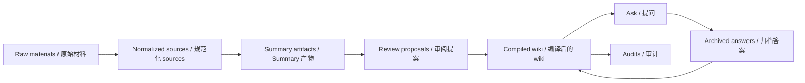

<h1 align="center">Research Wiki Compiler</h1>

<p align="center">
  <strong>把原始研究材料编译成可审阅、可追踪、可长期维护的本地 Markdown Wiki。</strong>
  <br />
  <strong>Compile raw research material into a local Markdown wiki that stays reviewable, traceable, and durable.</strong>
</p>

<p align="center">
  local-first / file-first / review-first / wiki-first retrieval
</p>

<p align="center">
  编译 → 审阅 → 提问 → 归档 → 审计
  <br />
  Compile → Review → Ask → Archive → Audit
</p>

<p align="center">
  <a href="#quickstart--快速开始">Quickstart / 快速开始</a>
  ·
  <a href="#quick-demo--快速体验">Quick Demo / 快速体验</a>
  ·
  <a href="./examples/openclaw-wiki/README.md">OpenClaw Example / OpenClaw 示例</a>
  ·
  <a href="./docs/architecture.md">Architecture / 架构</a>
  ·
  <a href="./docs/product-spec.md">Product Spec / 产品规格</a>
  ·
  <a href="./SUPPORT.md">Support / 支持</a>
  ·
  <a href="./SECURITY.md">Security / 安全</a>
  ·
  <a href="./CONTRIBUTING.md">Contributing / 贡献</a>
</p>

<p align="center">
  
  
  
  
</p>

<p align="center">
  <a href="./examples/openclaw-wiki/README.md"></a>
  <a href="#quickstart--快速开始"></a>
  <a href="./docs/architecture.md"></a>
  <a href="./docs/product-spec.md"></a>
</p>

Research Wiki Compiler 不是“上传文件然后聊天”的壳。它把原始资料放进本地工作区，生成可见的 summary、review proposal、answer artifact 和 audit report，并把真正长期维护的知识沉淀为 Markdown wiki 页面。  
Research Wiki Compiler is not an upload-and-chat shell. It lands raw material in a local workspace, produces visible summaries, review proposals, answer artifacts, and audit reports, and stores the durable knowledge layer as Markdown wiki pages.

- 原始材料先变成可见 artifact，再变成可审阅的 wiki mutation。  
  Raw material becomes visible artifacts first, then reviewable wiki mutation.
- 最终结果是持续维护的 Markdown wiki，不是一次性的模型输出。  
  The end state is a maintained Markdown wiki, not a one-shot model output.
- 好答案会重新进入 wiki，审计会继续暴露结构缺口。  
  Good answers re-enter the wiki, and audits keep exposing structural gaps.

| Visible artifacts / 可见产物 | Review-first mutation / 审阅优先变更 | Wiki-first retrieval / Wiki 优先检索 |
| --- | --- | --- |
| prompt、summary、proposal、audit 都保留在文件系统里。<br />Prompts, summaries, proposals, and audits stay visible on disk. | 知识更新先变成 proposal，再决定是否进入 wiki。<br />Knowledge updates become proposals before they mutate the wiki. | 回答先查 compiled wiki，再回退到 summary 和 raw chunks。<br />Answers consult the compiled wiki first, then fall back to summaries and raw chunks. |

## 为什么要做 / Why It Exists

研究工作真正稀缺的不是一次性回答，而是可以积累、修订、复查、再利用的知识结构。这个项目把“问答”降级为知识系统中的一个环节，把“编译后的 wiki”提升为长期真相层。  
The scarce thing in research is not one-off answers. It is knowledge that can be accumulated, revised, audited, and reused. This project treats Q&A as one loop inside a larger system, and treats the compiled wiki as the durable truth layer.

它面向的是这种工作方式：你持续收集原始材料，系统先把材料规范化和总结，再生成可审阅的知识变更，最后让回答、归档和审计重新回到 wiki。  
It is built for a workflow where raw material keeps arriving, the system normalizes and summarizes it first, then proposes reviewable knowledge changes, and finally feeds answers, archives, and audits back into the wiki.

## 核心工作流 / Core Workflow

| Loop | What it does |
| --- | --- |
| `Compile / 编译` | 导入 raw source，做 normalization、chunking、summary artifact 和 patch proposal。<br />Import raw sources, normalize them, chunk them, create summary artifacts, and generate patch proposals. |
| `Review / 审阅` | 先审阅 rationale、citations、sections 与 risk，再决定 approve、reject 或 edit-and-approve。<br />Inspect rationale, citations, sections, and risk first, then approve, reject, or edit-and-approve. |
| `Ask / 提问` | 回答优先检索 wiki 页面，再回退到 source summaries，最后才使用 raw chunks。<br />Answers retrieve wiki pages first, then source summaries, and only fall back to raw chunks at the end. |
| `Archive / 归档` | 把高价值答案回写成 synthesis 或 note 页面，让答案重新进入 compiled wiki。<br />Turn valuable answers into synthesis or note pages so answers re-enter the compiled wiki. |
| `Audit / 审计` | 运行 contradiction、coverage、orphan、stale、unsupported claims 等检查。<br />Run contradiction, coverage, orphan, stale, and unsupported-claims checks against the knowledge base. |

## 为什么它不一样 / Why It Feels Different

| 常见路径 / Common path | 这里的做法 / What this repo does |
| --- | --- |
| 一次性聊天记录 / Disposable chat transcripts | 持久化的 compiled wiki 页面 / Durable compiled wiki pages |
| 黑盒 memory / Black-box memory | 可见 prompts、summaries、reviews、audits / Visible prompts, summaries, reviews, and audits |
| 无状态 RAG-style 查询 / Stateless RAG-style querying | 明确的 wiki-first retrieval policy / An explicit wiki-first retrieval policy |
| 静默自动写作 / Silent auto-writing | review-first、人类批准的知识变更 / Review-first, human-approved knowledge mutation |
| 托管式封闭知识产品 / Closed hosted knowledge product | 本地工作区和文件优先的耐久层 / A local workspace and file-first durable layer |

## 核心能力 / Key Capabilities

- 工作区是可见的，不是藏在数据库里的。  
  The workspace is visible, not buried inside a database.
- Wiki 页面就是普通 Markdown 文件，带 frontmatter、wikilinks、backlinks 和 source refs。  
  Wiki pages are plain Markdown files with frontmatter, wikilinks, backlinks, and source refs.
- Source import、checksum、normalization、chunking 都是确定性的，可复查。  
  Source import, checksums, normalization, and chunking are deterministic and inspectable.
- Summary、proposal、answer、audit 都同时留在文件系统和数据库索引中。  
  Summaries, proposals, answers, and audits stay visible on disk while also being indexed in the database.
- Patch apply 优先做 section-level mutation，而不是粗暴整页重写。  
  Patch apply prefers section-level mutation instead of rewriting whole pages.
- Ask、archive、audit 不是额外功能，而是 compiled wiki 的闭环。  
  Ask, archive, and audit are not add-ons. They complete the compiled-wiki loop.

## 架构一览 / Architecture At A Glance



工作区文件是长期真相层；SQLite、Drizzle 和 FTS5 是运行时索引与查询层。  
Workspace files are the durable truth layer; SQLite, Drizzle, and FTS5 are the runtime indexing and query layer.

```text
WORKSPACE_ROOT/
  raw/               source inputs, normalized files, summaries
  wiki/              durable compiled knowledge in Markdown
  reviews/           pending / approved / rejected proposals
  audits/            human-readable audit reports
  prompts/           visible prompt contracts
  .research-wiki/    settings, SQLite database, caches, runs
```

## Quickstart / 快速开始

### Requirements / 环境要求

- Node.js 20+
- npm

### Install / 安装

```bash
npm install
npm run demo:reset
npm run dev
```

打开 [http://localhost:3000/dashboard](http://localhost:3000/dashboard)。  
Open [http://localhost:3000/dashboard](http://localhost:3000/dashboard).

### Provider configuration / Provider 配置

如果你想运行真实的 summarize、plan patches 或 ask 流程，请在 Settings 页面配置 OpenAI 或 Anthropic key。演示 workspace 在 seed 后会清空 provider credentials。  
If you want to run live summarize, patch-planning, or ask flows, configure an OpenAI or Anthropic key in Settings. The seeded demo workspace clears provider credentials after seeding.

### Verification / 验证命令

```bash
npm run lint
npm test
npm run test:e2e
npm run build
```

更完整的浏览器烟雾测试步骤见 [MANUAL_QA.md](./MANUAL_QA.md)。  
For a fuller browser smoke pass, see [MANUAL_QA.md](./MANUAL_QA.md).

## Quick Demo / 快速体验

1. 打开 `/dashboard`，确认 workspace 状态、最近活动与主循环入口。  
   Open `/dashboard` and inspect workspace state, recent activity, and the main loops.
2. 打开 `/sources`，查看 source import、normalized text、summary artifact 和 metadata。  
   Open `/sources` and inspect source import, normalized text, summary artifacts, and metadata.
3. 打开 `/reviews`，查看 proposal rationale、risk 和 patch diff。  
   Open `/reviews` and inspect proposal rationale, risk, and patch diffs.
4. 打开 `/wiki`，确认最终结果是文件驱动的 compiled wiki，而不是对话记录。  
   Open `/wiki` and confirm the result is a file-driven compiled wiki, not a transcript.
5. 打开 `/ask`，查看 grounded answer，再把高价值答案 archive 回 wiki。  
   Open `/ask`, inspect a grounded answer, and archive a valuable answer back into the wiki.
6. 打开 `/audits`，运行一次 audit 并查看可读报告。  
   Open `/audits`, run an audit, and inspect the readable report.

## 附带示例 / Included Example

仓库包含一个完整的 OpenClaw 端到端示例，位置在 [examples/openclaw-wiki/](./examples/openclaw-wiki/)。它优先使用用户提供的 OpenClaw 相关语料，跑通 import、summarize、plan patches、review/apply、ask、archive 和 audit，并把最终 wiki、summary、proposal 与 audit artifact 一起提交进仓库。  
The repository includes a full OpenClaw end-to-end example at [examples/openclaw-wiki/](./examples/openclaw-wiki/). It uses user-provided OpenClaw-related material first, runs import, summarize, patch planning, review/apply, ask, archive, and audit, and commits the resulting wiki, summaries, proposals, and audit artifacts into the repo.

```bash
npm run example:openclaw
```

优先查看：  
Start with:

- [examples/openclaw-wiki/workspace/wiki/index.md](./examples/openclaw-wiki/workspace/wiki/index.md)
- [examples/openclaw-wiki/workspace/wiki/entities/openclaw.md](./examples/openclaw-wiki/workspace/wiki/entities/openclaw.md)
- [examples/openclaw-wiki/workspace/wiki/syntheses/openclaw-maintenance-watchpoints.md](./examples/openclaw-wiki/workspace/wiki/syntheses/openclaw-maintenance-watchpoints.md)
- [examples/openclaw-wiki/workspace/wiki/notes/note-what-should-i-monitor-before-upgrading-openclaw.md](./examples/openclaw-wiki/workspace/wiki/notes/note-what-should-i-monitor-before-upgrading-openclaw.md)

## 截图 / Screenshots

截图还没有提交进仓库，但截图位已经明确保留。建议拍摄清单见 [docs/assets/screenshots/README.md](./docs/assets/screenshots/README.md)。  
Screenshots are not committed yet, but the capture plan is already defined. See [docs/assets/screenshots/README.md](./docs/assets/screenshots/README.md).

建议补齐的截图：  
Recommended screenshots:

- Dashboard overview / Dashboard 总览
- Sources detail with summary artifacts / Sources 详情与 summary artifacts
- Review queue with proposal diff / Review Queue 与 proposal diff
- Wiki browser and editor / Wiki 浏览与编辑
- Ask page with archive controls / Ask 页面与 archive 控件
- Audits page with findings detail / Audits 页面与 findings 详情

## 当前状态与限制 / Current Status And Limitations

- 这是一个认真构建的 MVP，不是概念验证，也不是 chat wrapper。  
  This is a serious MVP, not a proof-of-concept and not a chat wrapper.
- compile、review/apply、ask、archive、audit 这几条主循环已经打通。  
  The compile, review/apply, ask, archive, and audit loops are implemented end to end.
- 当前产品主要针对单人、本地研究工作流。  
  The current product is optimized for a solo, local research workflow.
- live provider-backed flows 仍然需要你自己的 API keys。  
  Live provider-backed flows still require your own API keys.
- 检索策略刻意采用结构化页面与 SQLite/FTS，而不是向量数据库。  
  The retrieval strategy intentionally uses structured pages and SQLite/FTS instead of a vector database.

## 文档与仓库信息 / Docs And Repository Info

- `产品规格 / Product Spec`: [docs/product-spec.md](./docs/product-spec.md)
- `架构 / Architecture`: [docs/architecture.md](./docs/architecture.md)
- `进度记录 / Progress`: [docs/progress.md](./docs/progress.md)
- `关键决策 / Decisions`: [docs/decisions.md](./docs/decisions.md)
- `手动 QA / Manual QA`: [MANUAL_QA.md](./MANUAL_QA.md)
- `支持 / Support`: [SUPPORT.md](./SUPPORT.md)
- `安全 / Security`: [SECURITY.md](./SECURITY.md)
- `贡献 / Contributing`: [CONTRIBUTING.md](./CONTRIBUTING.md)
- `许可证 / License`: [LICENSE](./LICENSE)

## 维护与发布信息 / Maintainer And Release Notes

- Maintainer: Horace
- GitHub handle: `@maxwelldhx`
- Repository: [Horace-Maxwell/research-wiki-compiler](https://github.com/Horace-Maxwell/research-wiki-compiler)
- Public contact: `maxwelldhx@gmail.com`
- Security contact: `maxwelldhx+security@gmail.com`
- License: Apache-2.0

仓库当前已公开，代码采用 Apache-2.0；但产品本身仍然是一个持续打磨中的本地优先 MVP。  
The repository is public and Apache-2.0 licensed, while the product itself remains a steadily improving local-first MVP.
